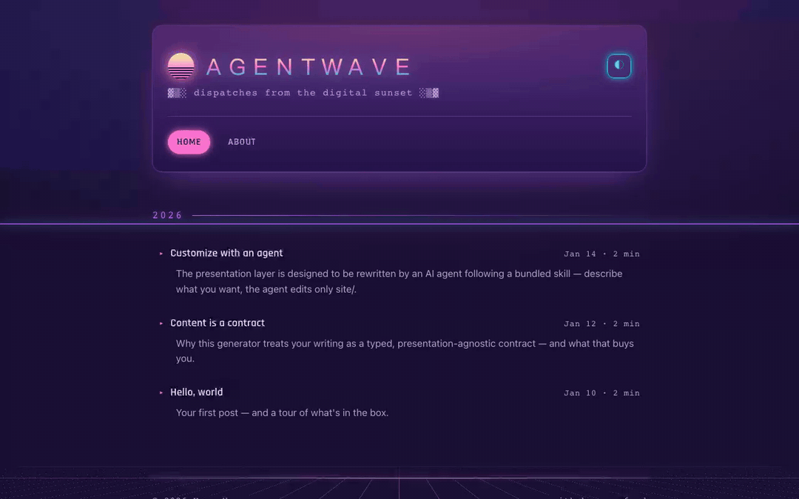
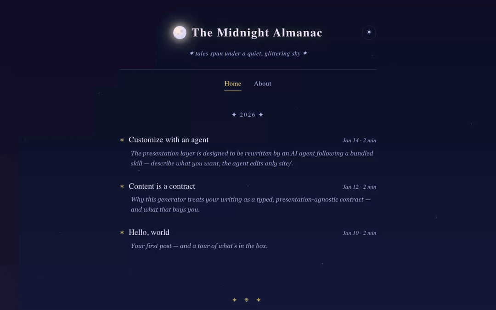
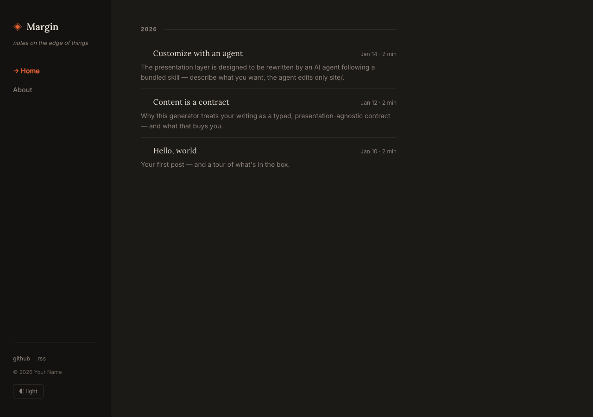
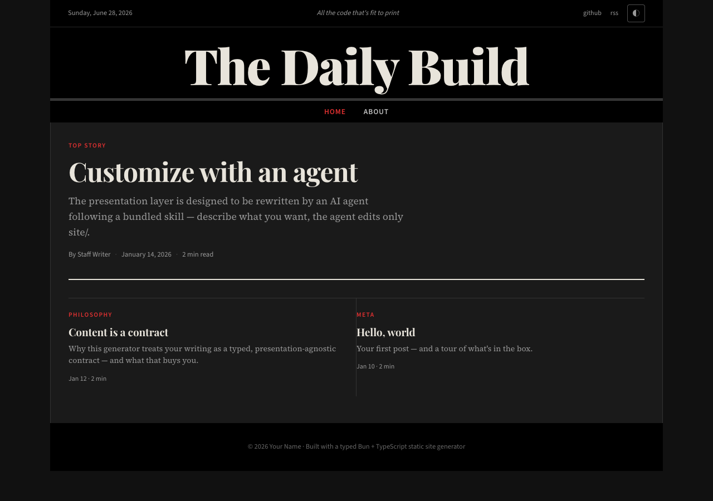
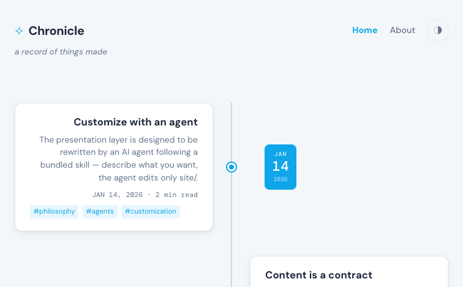
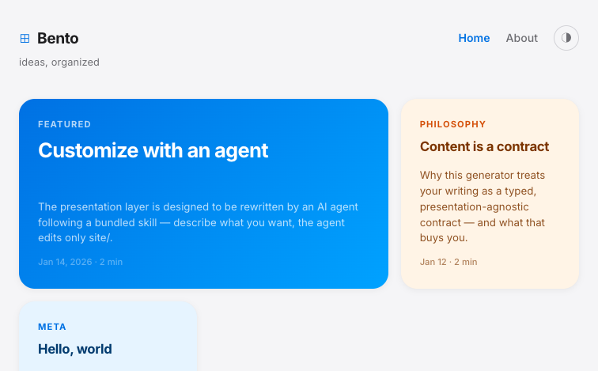
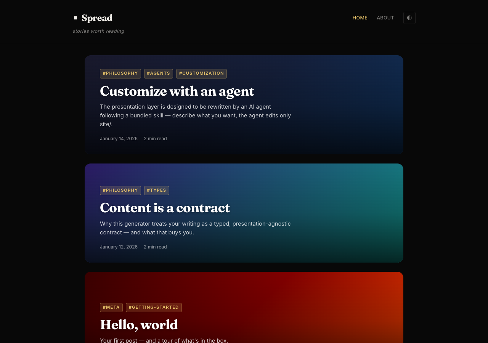

# Let an agent build your blog

[](https://github.com/trebaud/let-an-agent-build-your-blog/actions/workflows/ci.yml)
[](https://bun.sh)
[](https://www.typescriptlang.org)
[](#license)

A small static site generator (Bun + TypeScript) optimized for LLM agents.

No template DSL — a component is a function that takes typed content and returns an HTML string.
The whole look lives in a few small functions, so an agent can rewrite the presentation layer
without touching your writing or the build engine.

## Quick start

Requires [Bun](https://bun.sh) `1.x`.

```bash
bunx let-an-agent-build-your-blog my-blog
cd my-blog
bun dev   # build + watch + serve at http://localhost:3000 (drafts included)
```

Skip the theme prompt with a flag:

```bash
bunx let-an-agent-build-your-blog my-blog --theme cosmic   # premade theme
bunx let-an-agent-build-your-blog my-blog --theme custom   # design it with an agent
bunx let-an-agent-build-your-blog --list                   # list themes
```

**custom** scaffolds the base theme and prints the command to run the `customize` skill in
Claude Code, Codex, Pi, or any other agent.

## How it's organized

```
content/  →  core/ (parse)  →  site/ (render)  →  public/
```

- **`content/`** — posts and pages (Markdown + frontmatter). Frontmatter contract: [`content/README.md`](content/README.md).
- **`core/`** — the build engine. Don't edit.
- **`site/`** — the active theme: `site.config.ts`, `components/`, `styles/index.css`. Yours to rewrite.

Each premade theme is its own branch, so on any branch `site/` holds exactly one theme — nothing
for an agent to confuse it with.

## Customizing with an agent

The repo ships a `customize` skill at
[`.claude/skills/customize/`](.claude/skills/customize/SKILL.md) (mirrored under `.agents/`).
Describe the look and let it drive — it edits `site/` only:

> "Make it a warm sepia theme with a serif body font and a centered single-column layout."

> "Turn the post listing into a dense table and add a Projects page to the nav."

## Build & deploy

```bash
bun run build      # → public/
```

Set `BASE_URL` in `site/site.config.ts` first — it's baked into canonical URLs, Open Graph tags,
the sitemap, and the RSS feed.

## Theme gallery

**▶ Browse them all live: [trebaud.github.io/let-an-agent-build-your-blog](https://trebaud.github.io/let-an-agent-build-your-blog/)** (15 themes)

### Terminal — default

Monospace Tokyo-Night with a `brand@host` header.
[Live demo](https://trebaud.github.io/let-an-agent-build-your-blog/terminal/) · [`theme/terminal`](../../tree/theme/terminal)


### Minimal

One centered serif column on cream paper.
[Live demo](https://trebaud.github.io/let-an-agent-build-your-blog/minimal/) · [`theme/minimal`](../../tree/theme/minimal)


### Editorial

Magazine masthead with a responsive card grid.
[Live demo](https://trebaud.github.io/let-an-agent-build-your-blog/editorial/) · [`theme/editorial`](../../tree/theme/editorial)


### Personal

Centered hero with avatar and socials.
[Live demo](https://trebaud.github.io/let-an-agent-build-your-blog/personal/) · [`theme/personal`](../../tree/theme/personal)


### Retro

90s Web 1.0 in a Windows-95 window.
[Live demo](https://trebaud.github.io/let-an-agent-build-your-blog/retro/) · [`theme/retro`](../../tree/theme/retro)


### Notebook

Hand-drawn ruled-paper marker style.
[Live demo](https://trebaud.github.io/let-an-agent-build-your-blog/notebook/) · [`theme/notebook`](../../tree/theme/notebook)


### Vaporwave

80s neon synthwave, dark by default.
[Live demo](https://trebaud.github.io/let-an-agent-build-your-blog/vaporwave/) · [`theme/vaporwave`](../../tree/theme/vaporwave)



### Cosmic

Serif over a twinkling night sky.
[Live demo](https://trebaud.github.io/let-an-agent-build-your-blog/cosmic/) · [`theme/cosmic`](../../tree/theme/cosmic)



### Margin — sidebar

Fixed left sidebar with brand, nav and socials; Lora serif content column.
[Live demo](https://trebaud.github.io/let-an-agent-build-your-blog/sidebar/) · [`theme/sidebar`](../../tree/theme/sidebar)



### The Daily Build — newspaper

Classic broadsheet: dark Playfair masthead, featured top story, multi-column article grid.
[Live demo](https://trebaud.github.io/let-an-agent-build-your-blog/newspaper/) · [`theme/newspaper`](../../tree/theme/newspaper)



### Chronicle — timeline

Posts alternate left/right of a center spine with date bubbles.
[Live demo](https://trebaud.github.io/let-an-agent-build-your-blog/timeline/) · [`theme/timeline`](../../tree/theme/timeline)



### Bento — grid

Apple-style bento grid: featured cell spans 2 columns, smaller cells each get a distinct accent color.
[Live demo](https://trebaud.github.io/let-an-agent-build-your-blog/bento/) · [`theme/bento`](../../tree/theme/bento)



### Spread — cover cards

Full-bleed gradient cards per post. Fraunces display serif, vivid pastel gradients in light mode.
[Live demo](https://trebaud.github.io/let-an-agent-build-your-blog/covercards/) · [`theme/covercards`](../../tree/theme/covercards)



## License

MIT — see [LICENSE](LICENSE).
