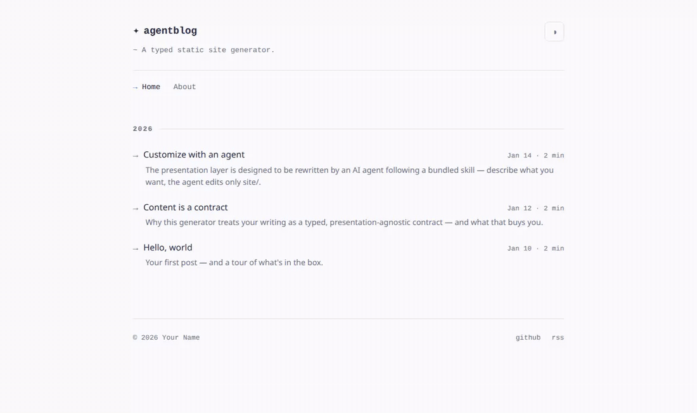
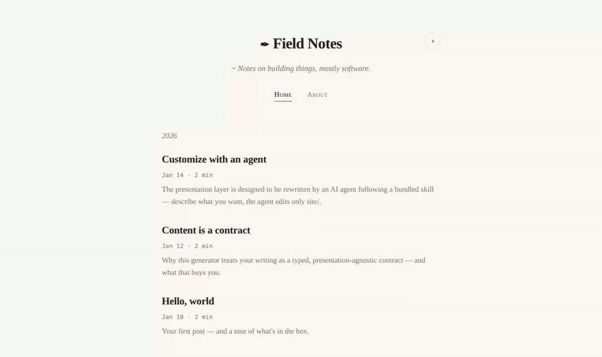
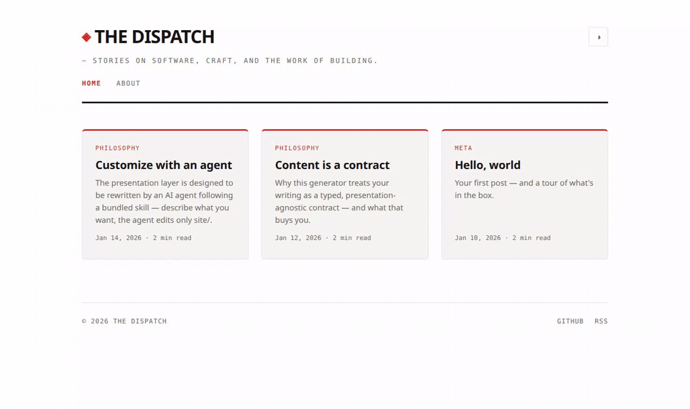
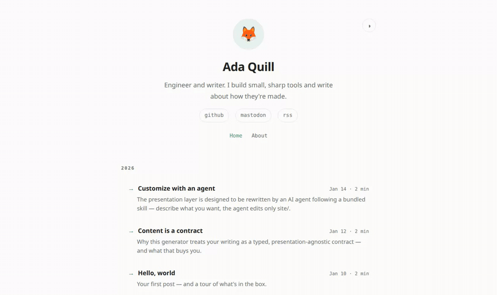

# Let an agent build your blog

[](https://github.com/trebaud/let-an-agent-build-your-blog/actions/workflows/ci.yml)
[](https://bun.sh)
[](https://www.typescriptlang.org)
[](#license)

A small static site generator (Bun + TypeScript) with one idea:

> **You don't need a templating engine.** Your content is typed data. Your theme is plain
> TypeScript functions. An agent restyles the site; the types guarantee it can't touch a word
> you wrote.

No Liquid, no Handlebars, no JSX runtime — a component is just a function that takes typed
content and returns an HTML string. That makes the whole presentation layer trivial for an
agent (or you) to rewrite, and impossible to rewrite *wrongly*: if a redesign breaks the
contract, `tsc` fails the build.

## Architecture

Three layers, one rule: **content and design never touch each other.**

```
content/   The writing — posts, pages, images. Typed, stable structure.
core/      The engine — parses content into a typed model, renders the site.
site/      The theme — everything the site looks like. Yours to rewrite.

content/  →  core/ (parse)  →  site/ (render)  →  public/
```

The arrow only points one way:

- `core/content.ts` parses Markdown into plain typed objects (`Post`, `Page`, `PostMeta`).
  That type **is** the contract between writing and design.
- `site/` imports that model **as a type only** — it never parses Markdown, and the engine
  never emits site HTML. Components are ordinary functions (`site/components/*.ts`):

  ```ts
  export const renderPostContent = (post: Post) => `<article>…</article>`
  ```

## Workflow: let an agent do the theming

The repo ships an agent skill at
[`.claude/skills/customize/`](.claude/skills/customize/SKILL.md). Instead of hand-editing CSS
and components, describe the outcome and let the **customize** skill drive it:

> "Make it a warm sepia theme with a serif body font and a centered single-column layout."

> "Turn the post listing into a dense table and add a projects page to the nav."

The skill interviews you to pin down the design, edits `site/` **only**

## Theme gallery

Four themes, each built by the **customize** skill from the same content, each living on its
own branch.

### Terminal / dev — the default

A monospace, Tokyo-Night palette with a `brand@host` header. Lives on `main` (also branched
as [`theme/terminal`](../../tree/theme/terminal)).



### Minimal / typographic — [`theme/minimal`](../../tree/theme/minimal)

One centered serif column on cream paper, generous whitespace, content first.



### Editorial / magazine — [`theme/editorial`](../../tree/theme/editorial)

A bold masthead and a responsive card grid with category kickers and an accent rule.



### Personal landing — [`theme/personal`](../../tree/theme/personal)

A centered hero with avatar, tagline, and social links over a compact post list.



Each theme is the diff of a single `git` branch against `main` — `site/styles/index.css`,
`site/site.config.ts`, and (for the editorial/personal layouts) a component or two. Nothing
in `content/` or `core/` changed.

## Quick start

```bash
bun install
bun dev   # build + watch + serve at http://localhost:3000 (drafts included)
```

Then:

1. Set `BASE_URL`, `AUTHOR`, title, nav, and socials in `site/site.config.ts`.
2. Add Markdown to `content/posts/` (frontmatter contract in `content/README.md`).
3. Restyle by asking an agent (the **customize** skill) — or edit `site/` by hand.

## Build & deploy

```bash
bun run build      # generates the site into public/
bun run typecheck  # tsc --noEmit — validates the content/design contract
```

Deploy the `public` build ouput to any static host (Netlify, Cloudflare Pages, GitHub
Pages, S3, Nginx…).

## License

MIT — see [LICENSE](LICENSE).
